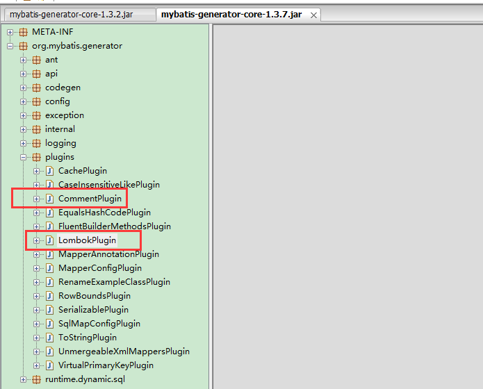

# mybatis-gen-plugin-ext

> 通过对`mybatis-generator-core` 插件的扩展，实现与`lombok`的结合。

## 使用方式
* 把plugin生成的字节码类文件，复制到对应的`mybatis-generator-core.jar`包的`plugins`目录下；
* 配置`generatorConfig.xml`中，插件的使用；
* 

## 具体示例
```xml
<?xml version="1.0" encoding="UTF-8"?>
<!DOCTYPE generatorConfiguration
        PUBLIC "-//mybatis.org//DTD MyBatis Generator Configuration 1.0//EN"
        "http://mybatis.org/dtd/mybatis-generator-config_1_0.dtd">
<generatorConfiguration>
    <!-- 说明: 本文件需要 ANSI编码,不能使用 UTF-8,所以 MyEclipse 并不能读取,请使用编辑工具进行编辑  -->
    <!-- 数据库驱动-->
    <classPathEntry location="mysql-connector-java-5.1.30.jar"/>
    <context id="mysql_context_vote" targetRuntime="MyBatis3">
        <property name="javaFileEncoding" value="UTF-8"/>
        <!-- 分页相关 -->
        <plugin type="org.mybatis.generator.plugins.RowBoundsPlugin"/>
        <!-- 带上序列化接口 -->
        <plugin type="org.mybatis.generator.plugins.SerializablePlugin"/>

        <!-- https://www.jianshu.com/p/7f57be69bb94 -->
        <!-- 自定义的注释生成插件-->
        <plugin type="org.mybatis.generator.plugins.CommentPlugin">
            <!-- 抑制警告 -->
            <property name="suppressTypeWarnings" value="true"/>
            <!-- 是否去除自动生成的注释 true：是 ： false:否 -->
            <property name="suppressAllComments" value="false"/>
            <!-- 是否生成注释代时间戳-->
            <property name="suppressDate" value="true"/>
        </plugin>
        <!-- 整合lombok-->
        <plugin type="org.mybatis.generator.plugins.LombokPlugin">
            <!--是否使用builder注解-->
            <property name="useBuilderAnnotation" value="true"/>
            <!--作者-->
            <property name="author" value="hager.w"/>
        </plugin>

        <commentGenerator>
            <property name="suppressDate" value="true"/>
            <!-- 是否去除自动生成的注释 true：是 ： false:否 -->
            <property name="suppressAllComments" value="true"/>
            <!--mybatis-generator 生成代码字段名默认按驼峰命名-->
            <property name="useActualColumnNames" value="false"/>
        </commentGenerator>

        <!--数据库链接URL，用户名、密码 -->
        <jdbcConnection driverClass="com.mysql.jdbc.Driver"
                        connectionURL="jdbc:mysql://localhost:3306/test?characterEncoding=UTF-8"
                        userId="root" password="xxxxxx"/>
        <javaTypeResolver>
            <property name="forceBigDecimals" value="false"/>
        </javaTypeResolver>
        <!-- 生成模型(Java Model)的包名和位置; 建议总的包为 com.cncounter.cncounter.model.xxx -->
        <javaModelGenerator targetPackage="com.test.dao.model"
                            targetProject="../src/main/java/">
            <property name="enableSubPackages" value="true"/>
            <property name="trimStrings" value="true"/>

        </javaModelGenerator>
        <!-- 生成映射(XML实现)文件的包名和位置; 注意多次生成后文件内会有重复,请自己解决 -->
        <!-- 建议总的包为 com.cncounter.cncounter.dao.mysql.xxx, 其他类型数据库类似 -->
        <sqlMapGenerator targetPackage="mapper" targetProject="../src/main/resources/">
            <property name="enableSubPackages" value="true"/>
        </sqlMapGenerator>
        <!-- 生成DAO(Java接口文件)的包名和位置; 建议总的包为 com.cncounter.cncounter.dao.api.xxx -->
        <javaClientGenerator type="XMLMAPPER" targetPackage="com.test.dao.mapper"
                             targetProject="../src/main/java/">
            <property name="enableSubPackages" value="true"/>
        </javaClientGenerator>
        <!-- 要生成的表 tableName是数据库中的表名或视图名 domainObjectName是实体类名 -->
        <!-- 这里可以有多个表, context也可以有多个,id唯一即可,比如要生成在多个子包下, -->
        <!-- enable *** ByExample 如果设为true,则会生成一个类似的 Example对象,以及Mapper中的示例XML -->
     
            <table tableName="trading_article" domainObjectName="TradingArticle"
                       enableCountByExample="false"
                       enableUpdateByExample="false"
                       enableDeleteByExample="false" 
                       enableSelectByExample="false" 
                       selectByExampleQueryId="false">
                </table>
    </context>

</generatorConfiguration>
```

## 参考
* https://github.com/mybatis/generator
* https://github.com/GuoGuiRong/mybatis-generator-lombok-plugin
* https://github.com/softwareloop/mybatis-generator-lombok-plugin
* https://www.jianshu.com/p/58ee7e09fc3f